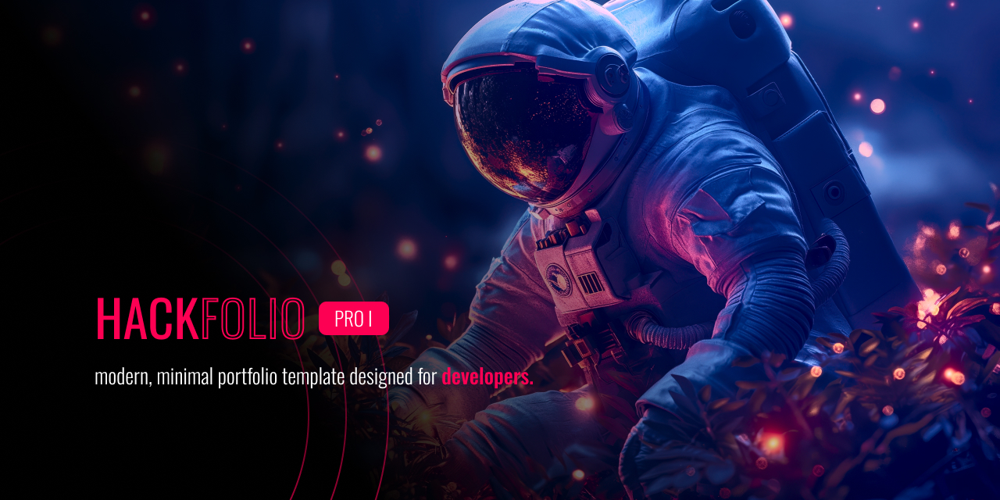

**Hackfolio** is a modern, minimal, and fully responsive portfolio template built with [Astro](https://astro.build/). Designed for developers and creators, it helps you showcase your skills, experience, and projects with a clean and professional look.

## ✦ Features

- **Minimal & Modern Design:** Clean UI with a focus on content and accessibility.
- **Responsive Layout:** Looks great on all devices.
- **Animated Skill Bars:** Show off your skills and frameworks with animated experience bars.
- **About & Education Sections:** Highlight your background and academic journey.
- **Contact Section:** Easy way for visitors to reach out via email or LinkedIn.
- **Social Links:** Quick access to your GitHub, LinkedIn, Twitter, Instagram, and more.
- **Easy Customization:** All content managed via a single `content.json` file.
- **Open Source:** Fork and make it your own!

## ✦ Demo

Check out a live demo: [kandepatilkunal.me](https://kunalkandepatil.me/)

## ✦ Getting Started

**I. Clone the repo:**
   ```cmd
   git clone https://github.com/kunalkandepatil/hackfolio.git
   cd hackfolio
   ```

**II. Install dependencies:**
   ```cmd
   npm install
   ```

**III. Start the development server:**
   ```cmd
   npm run dev
   ```

**IV. Customize your content:**
   - Edit `content.json` to update your name, skills, education, and more.
