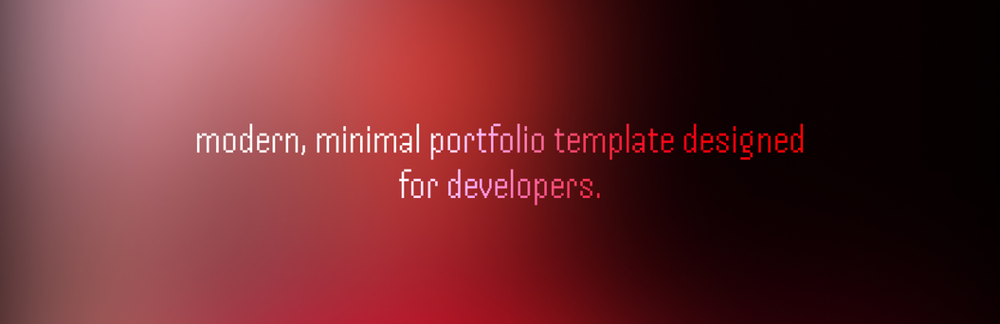
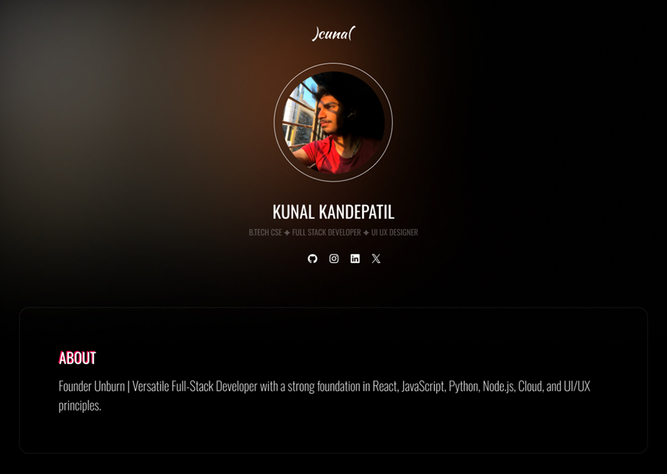

<div style="text-align: center">


<div style="margin: 20px 0px"></div>

<div><b>Hackfolio</b> is a modern, minimal, and fully responsive portfolio template built with Astro. Designed for developers and creators, it helps you showcase your skills, experience, and projects with a clean and professional look.</div>

<div style="margin: 20px 0px"></div>


---
</div>

## Features
- **Minimal & Modern Design**: Clean UI with a focus on content and accessibility.
- **Responsive Layout**: Looks great on all devices.
- **Animated Skill Bars**: Show off your skills and frameworks with animated experience bars.
- **About & Education Sections**: Highlight your background and academic journey.
- **Contact Section**: Easy way for visitors to reach out via email or LinkedIn.
- **Social Links**: Quick access to your GitHub, LinkedIn, Twitter, Instagram, and more.
- **Easy Customization**: All content managed via a single content.json file.
- **Open Source**: Fork and make it your own!

## Demo
Check out a live demo: [kunalkandepatil.me](https://kunalkandepatil.me)

## Get Started
1. Clone the repo:
```bash
git clone https://github.com/kunalkandepatil/hackfolio.git 
cd hackfolio
```

2. Install dependencies:
```bash
npm install
```

3. Start the development server:
```bash
npm run dev
```

4. Customize your content:
```
Edit content.json to update your name, skills, education, and more.
```

## Preview


If you find this project useful, please consider leaving a ⭐ on the repository to show your support!

## Support
For questions or support, join our [Discord community](https://discord.gg/5EZW4tc6AH) to connect with other users and get help.